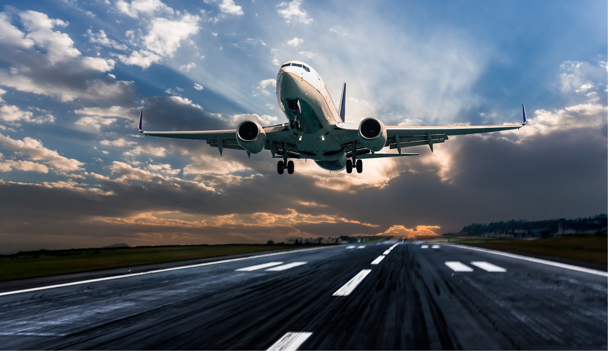

<html lang="fr">
<head>
    <meta charset="UTF-8">
    <meta name="viewport" content="width=device-width, initial-scale=1.0">
    <title>Destinations de rêve</title>
    <link rel="stylesheet" href="index.css">
    <link rel="stylesheet" href="mecque.html">
    <link rel="stylesheet" href="paris.html">
    <link rel="stylesheet" href="rome.html">
    <link rel="stylesheet" href="tokyo.html">
    <link rel="stylesheet" href="sydney.html">
    <link rel="stylesheet" href="new-york.html">
    
</head>
<body> 
        <header>
            <nav>
            <h1>
                Destinations de rêve</h1>
            <ul>
             <h2>Accueil</h2>
            </ul>
            </nav>
        </header>
        <main>
            

                

                    <h2><a href="mecque.html">Mecque</a></h2>
                    
Occupant une vallée désertique dans l'ouest de l'arabie saoudite ,elle est la ville la plus sainte de l'islam.

                    

                        

                            
                      

                    

                

               

                    <h2><a href="paris.html">Paris</a></h2>
                    
La Ville Lumière vous attend avec ses monuments emblématiques, sa cuisine délicieuse et son charme romantique.

                    

                        

                            
                      

                    

                

                

                    <h2><a href="new-york.html">New York</a></h2>
                    
La ville qui ne dort jamais ! Découvrez la Statue de la Liberté, Times Square et la diversité culturelle.

                   

                         
                   
 
                

                

                    <h2><a href="tokyo.html">Tokyo</a></h2>
                    
Explorez la fusion entre tradition et modernité dans la capitale japonaise. Visitez les temples et les gratte-ciel.

                    

                        
                  
 
                

                

                    <h2><a href="rome.html">Rome</a></h2>
                    
La Cité éternelle vous attend avec son histoire fascinante, ses ruines antiques et sa cuisine italienne.

                    

                        
                   
 
                

                

                    <h2><a href="sydney.html">Sydney</a></h2>
                    
Profitez des plages, de l'opéra emblématique et de la vie nocturne animée dans la plus grande ville d'Australie.

                    

                        

                        
                        

                  

                

            

        </main>
            <aside class="slideshow">
                
                
                
                
            </aside>
<aside1 class="slideshow1">
    <h3>Au Sénégal, on compte trois aéroports internationaux et cinq aéroports régionaux. Voici la liste des principaux aéroports du pays:</h3>
    

        

            
        

        <h2>Aéroport international Blaise Diagne (AIBD):</h2>
        <h3>
            L'aéroport international Blaise-Diagne est situé à Diass à 47 km au sud-est de Dakar capitale du Sénégal, à proximité de la Petite-Côte. Inauguré le 7 décembre 2017, il remplace l'ancien aéroport international Léopold-Sédar-Senghor de Dakar.
                Situé à Dakar, c’est le plus important du pays, avec 4,3 millions de passagers en 2022.
        </h3>
    

    

        

            
        

        <h2>Aéroport international Léopold Sédar Senghor (ALS):</h2>
        <h3>
                L'ancien aéroport international Léopold-Sédar-Senghor (AILSS) de Dakar est situé à proximité du village de Yoff, commune localisée au nord-ouest de Dakar. Pendant 70 ans, de 1947 à 2017, il a été le principal aéroport civil du Sénégal. À la suite de l’ouverture le 7 décembre 2017 de l’aéroport international Blaise Diagne (AIBD), il a été transformé en aéroport militaire et la gestion a été confiée à l'armée nationale depuis le 8 décembre 2017.
        </h3>
    

    

        

            
        

        <h2>Aéroport international de Tamba-Diama (ATD):</h2>
        <h3>L'aérodrome de Tambacounda est un aérodrome situé à Tambacounda, dans le sud-est du Sénégal. </h3>
               
    

</aside1>
<h3>En plus de ces aéroports internationaux, voici quelques aéroports régionaux au Sénégal:</h3>
<aside2>
    

        
Aéroport de Cap Skirring (CSK) et Aéroport de Ziguinchor (ZIG)  qui se trouve tous les deux à  Ziguinchor

        
Aéroport de Kaolack (KLC) à Kaolack

        
Aéroport de Kédougou (KGG) à Kédougou

        
Aéroport de Saint-Louis (XLS) à Saint-Louis

    

</aside2>
<h3>Ces aéroports jouent un rôle essentiel dans la connectivité du Sénégal avec le reste du monde. Les principales compagnies aériennes nationales et internationales qui desservent le Sénégal sont Air France, Royal Air Maroc, Brussels Airlines, Turkish Airlines et Air Senegal</h3>
<aside class="slideshow3">
                
                
                
                
                
</aside>
<footer>
    
Ce site web a été créé par <a href="mailto:exemple@exemple.com">Michel Ibrahima Niang</a>.

    
Suivez-moi sur les réseaux sociaux :

    

        <a href="https://www.facebook.com/Niang Michel">Facebook</a> |
        <a href="https://www.twitter.com/">Twitter</a> |
        <a href="https://www.instagram.com/Niang Michel">instagram</a>
    

    
&copy; 2024 Mon Site de Tourisme. Tous droits réservés.

    <nav>
        <a href="#">Accueil</a>/
        <a href="#">Destinations</a>/
        <a href="#">Contact</a>
    </nav>
</footer>
</body>
</html>
